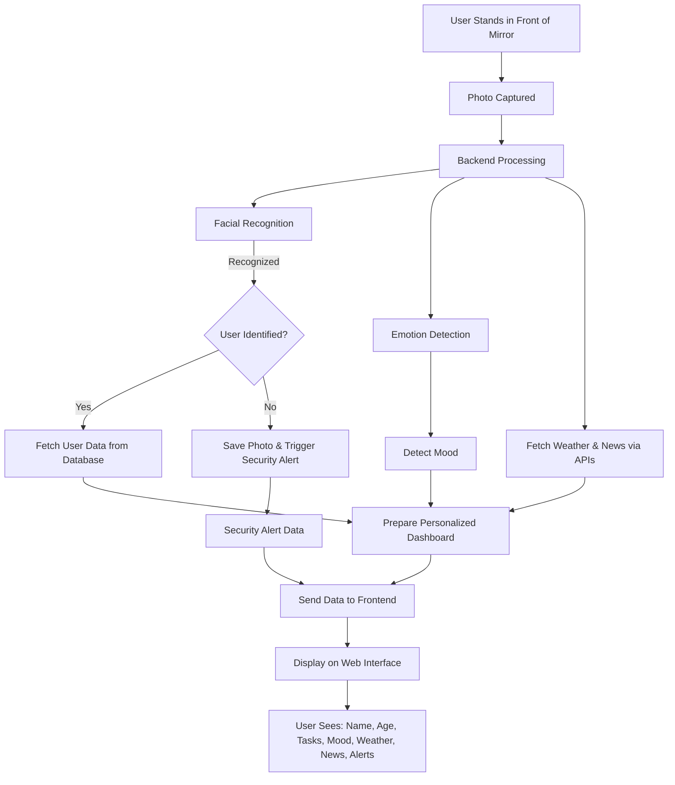

# SmartMirror  
**A sleek, deep learning-powered mirror that recognizes faces, detects emotions, and delivers personalized insights with real-time security alerts.**

  

---

## 🚀 What is SmartMirror?
Imagine a mirror that knows you! SmartMirror uses **deep learning** to:
- **Recognize your face** and greet you by name.
- **Detect your mood** to brighten your day.
- **Show personalized info** like tasks, weather, and news.
- **Alert you** if an unknown face appears.

Perfect for a futuristic home or a standout course project!

---

## ✨ Features
| Feature              | Description                              |
|----------------------|------------------------------------------|
| **Facial Recognition** | Identifies users with precision         |
| **Emotion Detection**  | Reads your mood (happy, sad, etc.)     |
| **Personalized Dashboard** | Tasks, weather, news – just for you |
| **Security Alerts**    | Spots unknowns and saves their photo   |

---

## 🛠️ How It Works
Here’s the magic behind SmartMirror:


---

## 🏃‍♂️ Get Started
1. **Clone the Repo**  
   ```bash
   git clone https://github.com/naveennokhwal/SmartMirror.git
   ```
2. **Install Dependencies**  
   ```bash
   pip install -r requirements.txt
   ```
3. **Run the App**  
   ```bash
   python src/main.py
   ```

Check `/docs/setup.md` for detailed instructions!

---

## 🧠 Tech Stack
- **Python**: Core language
- **TensorFlow/PyTorch**: Deep learning models
- **Flask**: Web interface
- **OpenCV**: Image processing
- **APIs**: Weather & News integration

---

## 📸 Demo
Coming soon! See `/docs/demo.md` for screenshots and updates.

---

## 🤝 Contribute
Love the idea? Fork it, tweak it, PR it! Issues and suggestions welcome.

---

⭐ **Star this repo if you like it!** ⭐  
Built with 💻 and ❤️ by [Your Name]
```

---
